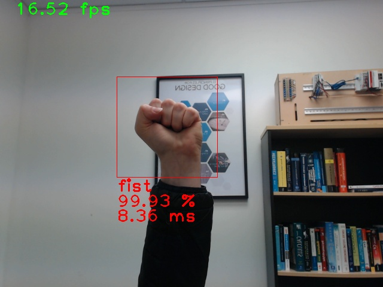
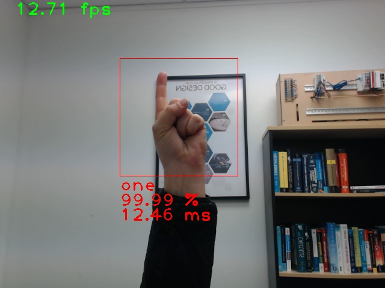
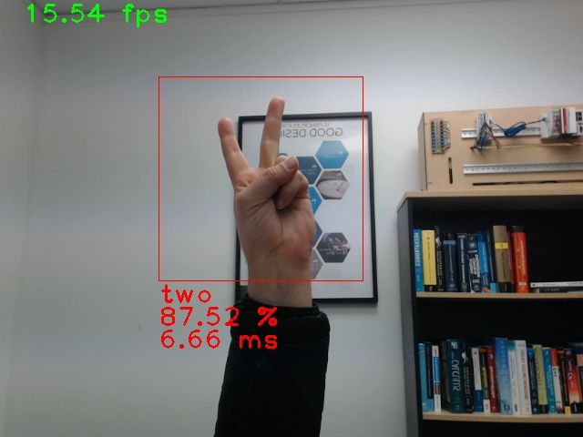
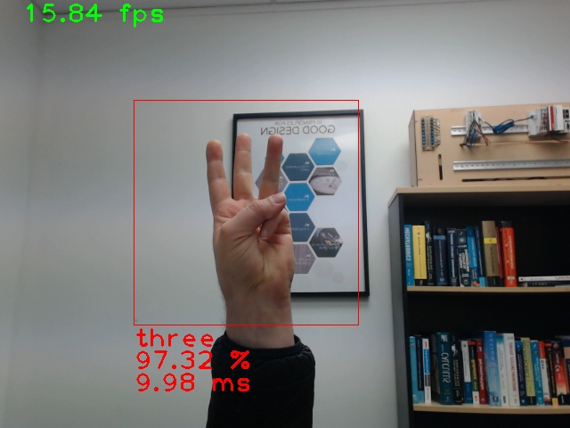
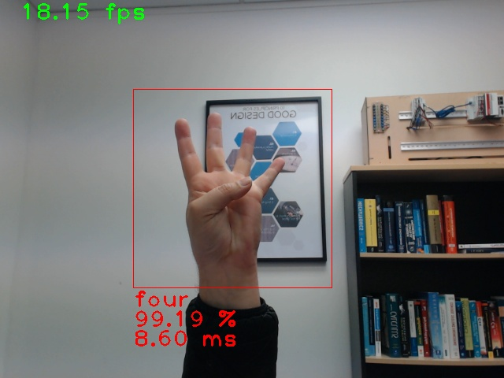
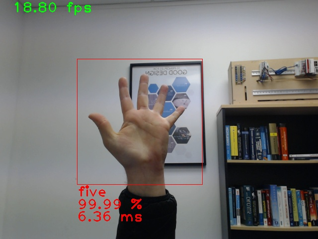

# Gesture Recognition Application

  


## Introduction

Human hand gesture recognition has become an increasingly important area of research in recent years, with potential applications in fields ranging from Human-Computer Interaction (HCI) and robotics to healthcare and accessibility. 

The ability to accurately, and reliably, recognize hand gestures has the potential to improve communication and interaction between humans and machines, and to provide new ways of accessing and processing information. However, hand gesture recognition is a complex task, and there are many factors that can impact its accuracy and reliability. 

In my research, I have evaluated the performance of the state-of-the-art, machine learning-based, classification models with application to human hand gesture recognition. 

Here, I share the source code used to show that a fine-tuned, state-of-the-art, machine learning-based, classifcation model can be used to perform hand gesture recognition in a real world application.

## Repository Structure

The repository is organised as follows:

```console
/img
    /app_fist.jpg
    ...
/src
    /saved_models
        /MobileNet_V3_Small_Weights.pth
        ...
    app.py
LICENCE
README.md
requirements.txt
```

`/src` contains `/saved_models` and `app.py`. `/saved_models` contains `MobileNet_V3_Small_Weights.pth`, a model fine-tuned to classify gestures into one of the following gestures: Fist, One, Two, Three, Four, or Five. `app.py` loads the model, grabs frames from a camera, makes a prediction, and displays an annotated frame to the user.

## Getting Started

Before you try to run `app.py`, you need to install the `mediapipe`, `opencv-python`, and `torch` and `torchvision` libraries.

Open a new instance of a terminal.

Type the following commands into the terminal and press <kbd>Enter</kbd> after one:

```console
python -m pip install --upgrade pip
python -m pip install mediapipe
python -m pip install opencv-python
python -m pip install torch torchvision --index-url https://download.pytorch.org/whl/cu117
```
Afterwards, you will have an environment with all of `app.py`'s dependencies installed.

## Running `app.py`

To run `app.py`, type the following commands into a terminal and press <kbd>Enter</kbd> after each one:

```console
cd ./src
python app.py
```

Figure 1 illustrates the output you should expect to see.

## Command Line Arguments

`app.py` accepts the following arguments:

```console
usage: app.py [-h] [-m MODEL] [-c CLASSES] [-d DEVICE] [-dw DRAW]

optional arguments:
  -h, --help            show this help message and exit
  -m MODEL, --model MODEL 
  -c CLASSES, --classes CLASSES
  -d DEVICE, --device DEVICE
  -dw DRAW, --draw DRAW      
```

`--model` sets the model's file path.
`--classes` sets the models's list of class labels.
`--device` sets the device used for inference.
`--draw` sets whether hand landmarks are drawn.

## Sample Output

The following figure illustrates the app working. Each of the gestures is presented to the camera. The app grabs a frame and the model makes a prediction. The predicted gesture's label, the model's confidence, and the model's inference time is added to the frame. The annotated frame is then displayed to the user.

|     |     |     |
|:---:|:---:|:---:|
|  |  |  |
| (a) | (b) | (c) |
|  |  |  |
| (d) | (e) | (f) |

**Figure 1**: Annotated frames captured from the app. (a) Fist; (b) One; (c) Two; (d) Three; (e) Four; and (f) Five. 

The following video demonstrates the app working.

[](https://www.youtube.com/watch?v=uUZ9sKOJF-k)

**Figure 2**: Video of the app working.

## Credit

Dr Frazer K. Noble (drfknoble)  
[http://drfknoble.com](http://drfknoble.com)
